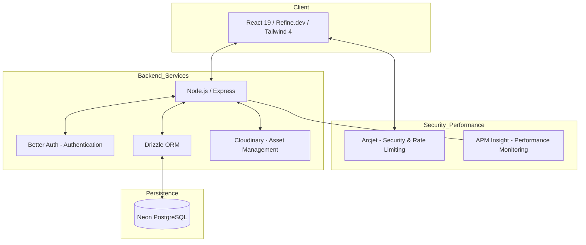

# 🎓 Classroom Management System

A high-performance, full-stack platform designed to streamline classroom administration, student enrollment, and academic reporting. This project leverages modern serverless infrastructure and type-safe development patterns to provide a seamless experience for both educators and students.

## 🚀 Project Vision

The goal of this system is to bridge the gap between administrative overhead and effective teaching. By providing real-time statistics, automated enrollment workflows, and a robust data architecture, the platform ensures that educators can focus on instruction while the system handles the complexities of classroom management.

## 🏗️ System Architecture



## 🛠️ Quick Start

### 1. Clone the Repository
```bash
git clone https://github.com/your-username/DashBoard_Project.git
cd DashBoard_Project
```

### 2. Backend Setup
```bash
cd classroom-backend
npm install
cp .env.example .env # Configure variables
npm run db:generate && npm run db:migrate
npm run dev
```

### 3. Frontend Setup
```bash
cd ../classroom-frontend
npm install
npm run dev
```

## 📂 Project Structure

*   [**classroom-backend**](./classroom-backend/README.md): Node.js API with Drizzle ORM, Better Auth, and Arcjet security.
*   [**classroom-frontend**](./classroom-frontend/README.md): React 19 dashboard powered by Refine.dev and Shadcn/UI.